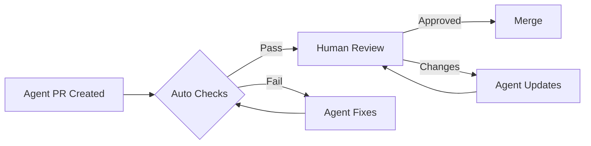

# Coding Agents

<div class="hero-container">
  
</div>

Coding Agents represent the cutting edge of AI-assisted development, offering autonomous capabilities that can handle complex development tasks with minimal human intervention.

## What are Coding Agents?

Coding Agents are AI systems that can:

- Understand complex requirements
- Plan and execute multi-step tasks
- Write, test, and debug code
- Interact with development tools
- Learn from feedback and iterate

## Evolution of AI Coding

```
Traditional IDE → Code Completion → Copilot → Copilot Chat → Coding Agents
     |                 |               |          |              |
  Manual           Simple          Context    Interactive    Autonomous
  coding          snippets         aware       assistance     execution
```

## Agent Capabilities

### Task Understanding

Agents can comprehend complex requirements:

> "Implement a rate limiter for our API that allows 100 requests per minute per user, with burst allowance of 20, and returns appropriate headers"

### Planning

Agents break down tasks:

```
📋 Plan Generated:
1. Analyze existing middleware structure
2. Create RateLimiter class with sliding window
3. Implement token bucket for burst handling
4. Add rate limit headers to responses
5. Create Redis storage for distributed systems
6. Write unit tests
7. Add integration tests
8. Update API documentation
```

### Execution

Agents write and modify code:

```python
# Generated by Coding Agent
class RateLimiter:
    def __init__(self, redis_client, max_requests=100, 
                 window_seconds=60, burst_allowance=20):
        self.redis = redis_client
        self.max_requests = max_requests
        self.window_seconds = window_seconds
        self.burst_allowance = burst_allowance
    
    async def check_limit(self, user_id: str) -> RateLimitResult:
        """Check if request is within rate limits."""
        key = f"rate_limit:{user_id}"
        current_time = time.time()
        
        # Sliding window implementation
        pipeline = self.redis.pipeline()
        pipeline.zremrangebyscore(key, 0, current_time - self.window_seconds)
        pipeline.zcard(key)
        pipeline.zadd(key, {str(current_time): current_time})
        pipeline.expire(key, self.window_seconds)
        
        _, request_count, _, _ = await pipeline.execute()
        
        remaining = max(0, self.max_requests - request_count)
        allowed = request_count < (self.max_requests + self.burst_allowance)
        
        return RateLimitResult(
            allowed=allowed,
            remaining=remaining,
            reset_time=int(current_time) + self.window_seconds
        )
```

### Self-Correction

Agents can debug their own code:

```
🔍 Running tests...
❌ Test failed: test_burst_allowance

📋 Analysis:
- Burst allowance not being applied correctly
- Issue in check_limit comparison

🔧 Fix applied:
- Changed comparison logic
- Added burst_used tracking

✅ All tests passing
```

## Types of Coding Agents

### PR Review Agents

Automatically review pull requests:

- Check code quality
- Identify potential bugs
- Suggest improvements
- Verify test coverage

### Test Generation Agents

Create comprehensive test suites:

- Unit tests
- Integration tests
- Edge case coverage
- Property-based tests

### Documentation Agents

Maintain documentation:

- API documentation
- README updates
- Code comments
- Architecture diagrams

### Migration Agents

Handle code migrations:

- Framework upgrades
- Language version updates
- Dependency migrations
- Breaking change fixes

## Using Coding Agents

### GitHub Copilot Coding Agent

```yaml
# .github/copilot-agent.yml
name: Feature Implementation
trigger:
  - issues.labeled:
      label: "copilot-agent"

agent:
  model: copilot-agent
  permissions:
    - write:code
    - create:branch
    - create:pr
  
  workflow:
    - understand: issue.body
    - plan: implementation
    - execute: code_changes
    - test: run_tests
    - submit: pull_request
```

### Interaction Patterns

**Autonomous Mode:**
Agent works independently, only asking for approval at key checkpoints.

**Collaborative Mode:**
Agent proposes changes and waits for human feedback at each step.

**Supervised Mode:**
Human reviews and approves each action before execution.

## Best Practices

### Clear Requirements

Provide detailed issue descriptions:

```markdown
## Feature: User Export

### Requirements
- Export user data as CSV or JSON
- Include: name, email, signup_date, plan_type
- Support date range filtering
- Handle large datasets (pagination/streaming)

### Acceptance Criteria
- [ ] API endpoint: GET /api/users/export
- [ ] Supports format query param
- [ ] Handles 100k+ users without timeout
- [ ] Includes progress indication for large exports
```

### Guard Rails

Set appropriate limits:

```yaml
agent_limits:
  max_files_modified: 20
  max_lines_changed: 500
  require_tests: true
  require_documentation: true
  blocked_paths:
    - "config/production/*"
    - ".env*"
```

### Review Process



## Limitations and Considerations

### Current Limitations

!!! warning "Be Aware"
    - May not understand complex domain logic
    - Can make incorrect assumptions
    - Limited context window
    - May need guidance on architectural decisions

### When to Use Humans

| Task | Agent | Human |
|------|-------|-------|
| Boilerplate code | ✅ | |
| Bug fixes | ✅ | |
| Feature implementation | ⚠️ With review | |
| Architecture decisions | | ✅ |
| Security-critical code | | ✅ |
| Performance optimization | ⚠️ | ✅ |

## Future of Coding Agents

### Emerging Capabilities

<div class="feature-list">
  <div class="feature-item">
    <span class="icon">🧠</span>
    <div>
      <strong>Better Reasoning</strong>
      <p>More sophisticated problem-solving</p>
    </div>
  </div>
  <div class="feature-item">
    <span class="icon">🔄</span>
    <div>
      <strong>Continuous Learning</strong>
      <p>Agents that improve from feedback</p>
    </div>
  </div>
  <div class="feature-item">
    <span class="icon">🤝</span>
    <div>
      <strong>Multi-Agent Collaboration</strong>
      <p>Specialized agents working together</p>
    </div>
  </div>
  <div class="feature-item">
    <span class="icon">🔌</span>
    <div>
      <strong>Tool Ecosystem</strong>
      <p>Integration with more development tools</p>
    </div>
  </div>
</div>

### The Human-Agent Partnership

The future isn't agents replacing developers, but augmenting them:

- Humans: Strategy, creativity, judgment
- Agents: Execution, consistency, speed

Together: Better software, faster delivery

---

<div class="resource-links">
<h2>📚 Resources</h2>
<ul>
<li><a href="https://github.blog/news-insights/product-news/github-copilot-the-agent-awakens/" target="_blank" rel="noopener">GitHub Blog: Copilot Agent Mode</a></li>
<li><a href="https://docs.github.com/en/copilot" target="_blank" rel="noopener">GitHub Copilot Documentation</a></li>
<li><a href="https://github.blog/changelog/" target="_blank" rel="noopener">GitHub Changelog</a></li>
<li><a href="https://githubnext.com/" target="_blank" rel="noopener">GitHub Next - Future Features</a></li>
</ul>
</div>
