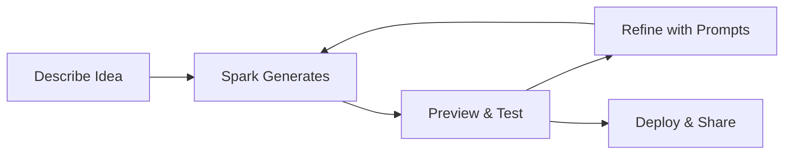

# GitHub Spark

  

GitHub Spark is an innovative tool that allows anyone to create micro-applications using natural language, making software development accessible to everyone.

## What is GitHub Spark?

GitHub Spark enables users to build functional applications by simply describing what they want in plain English. No coding experience required!

### Core Concept

> "Describe your app idea, and Spark brings it to life"

Spark bridges the gap between idea and implementation, letting you:

- Create apps without writing code
- Iterate rapidly through conversation
- Deploy instantly to share with others
- Customize as your needs evolve

## How Spark Works

### The Creation Flow

1. **Describe**: Tell Spark what you want to build
2. **Generate**: Spark creates a working prototype
3. **Preview**: Test the app in real-time
4. **Refine**: Request changes in natural language
5. **Deploy**: Share your creation with others

## Example Applications

### Personal Dashboard

**Prompt:**
> "Create a personal dashboard that shows the current weather, my upcoming calendar events, and a to-do list"

**Result:** A fully functional dashboard with:
- Weather widget with location detection
- Calendar integration
- Interactive to-do list with persistence

### Team Voting App

**Prompt:**
> "Build a team lunch voting app where people can suggest restaurants and vote on their favorites"

**Result:**
- Restaurant submission form
- Voting interface
- Real-time results display
- Winner announcement

### Habit Tracker

**Prompt:**
> "Create a habit tracker where I can add habits, check them off daily, and see my streaks"

**Result:**
- Add/remove habits
- Daily check-in interface
- Streak calculations
- Progress visualizations

## Key Features

### Natural Language Iteration

Refine your app through conversation:

| Your Request | Spark's Response |
|-------------|------------------|
| "Make the background blue" | Updates color scheme |
| "Add a dark mode toggle" | Implements theme switching |
| "Show data in a chart" | Adds visualization |
| "Save data between sessions" | Adds persistence |

### Instant Preview

See changes in real-time:

- No build steps
- No deployment delays
- Immediate feedback
- Mobile preview

### Easy Sharing

Share your Spark apps:

- Unique shareable URLs
- Embed in websites
- Mobile-friendly links
- No installation required

## Use Cases

  

    📊
    

      <strong>Internal Tools</strong>
      
Quick utilities for your team

    

  

  

    📝
    

      <strong>Prototypes</strong>
      
Rapid idea validation

    

  

  

    🎮
    

      <strong>Simple Games</strong>
      
Interactive experiences

    

  

  

    📱
    

      <strong>Personal Apps</strong>
      
Custom tools for yourself

    

  

## Spark vs Traditional Development

| Aspect | GitHub Spark | Traditional Development |
|--------|--------------|------------------------|
| Time to prototype | Minutes | Hours/Days |
| Coding required | None | Extensive |
| Learning curve | Low | High |
| Customization | Prompt-based | Code-based |
| Best for | Simple apps | Complex systems |

## Tips for Better Sparks

### Be Descriptive

❌ *"Make me an app"*

✅ *"Create a recipe organizer where I can add recipes with ingredients and instructions, tag them by cuisine type, and search through my collection"*

### Start Simple, Then Iterate

1. Begin with core functionality
2. Test the basics
3. Add features incrementally
4. Refine the design

### Use Specific Examples

> "When I click the 'Add' button, a form should appear asking for: name, email, and phone number"

### Request Visual Improvements

- *"Make it look more professional"*
- *"Use a modern color scheme"*
- *"Add smooth animations"*
- *"Make it responsive for mobile"*

## Limitations

!!! info "Current Limitations"
    - Best for simple, single-purpose apps
    - Limited backend complexity
    - May require code for advanced features
    - Data persistence has limits

## Getting Started

1. Visit GitHub Spark (when available in your region)
2. Sign in with your GitHub account
3. Start with a simple description
4. Iterate and refine
5. Share your creation!

---

<h2>📚 Resources</h2>
<ul>
<li><a href="https://github.blog/news-insights/product-news/github-spark-the-next-chapter-in-collaborative-software-development/" target="_blank" rel="noopener">GitHub Blog: Introducing Spark</a></li>
<li><a href="https://githubnext.com/projects/github-spark" target="_blank" rel="noopener">GitHub Next: Spark Project</a></li>
<li><a href="https://docs.github.com/en/copilot" target="_blank" rel="noopener">GitHub Copilot Documentation</a></li>
<li><a href="https://github.blog/changelog/" target="_blank" rel="noopener">GitHub Changelog</a></li>
<li><a href="https://github.com/features/spark" target="_blank" rel="noopener">GitHub Spark</a></li>
</ul>

