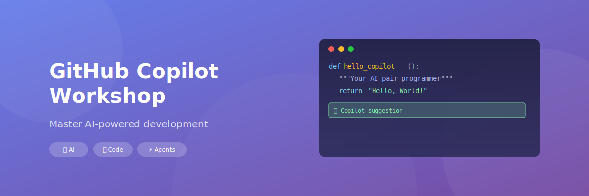

# GitHub Copilot Workshop

  

Welcome to the **GitHub Copilot Workshop**! This comprehensive guide will help you master GitHub Copilot and its various features to supercharge your development workflow.

## What You'll Learn

This workshop covers everything from basic GitHub Copilot usage to advanced features like Agent Mode, custom instructions, and effective prompting techniques.

  

    🤖
    

      <strong>AI-Powered Coding</strong>
      
Learn how AI can assist you in writing better code faster.

    

  

  

    💬
    

      <strong>Interactive Chat</strong>
      
Master Copilot Chat for code explanations and refactoring.

    

  

  

    🎯
    

      <strong>Effective Prompting</strong>
      
Craft prompts that get the results you need.

    

  

  

    ⚡
    

      <strong>Agent Mode</strong>
      
Automate complex tasks with AI agents.

    

  

## Workshop Chapters

  

    <h3>📚 Introduction to GitHub Copilot</h3>
    
Get started with GitHub Copilot and understand its core capabilities.

    <a href="chapters/introduction/" class="md-button">Start Learning →</a>
  

  

    <h3>💬 Chat Mode</h3>
    
Interactive conversations with Copilot for code assistance.

    <a href="chapters/chat-mode/" class="md-button">Explore →</a>
  

  

    <h3>✏️ Edit Mode</h3>
    
Make inline edits and modifications with AI assistance.

    <a href="chapters/edit-mode/" class="md-button">Explore →</a>
  

  

    <h3>🤖 Agent Mode</h3>
    
Autonomous AI agents that can perform complex tasks.

    <a href="chapters/agent-mode/" class="md-button">Explore →</a>
  

  

    <h3>✨ GitHub Spark</h3>
    
Create micro-apps with natural language.

    <a href="chapters/github-spark/" class="md-button">Explore →</a>
  

  

    <h3>🏢 AgentHQ</h3>
    
Manage and orchestrate AI agents effectively.

    <a href="chapters/agenthq/" class="md-button">Explore →</a>
  

  

    <h3>🎛️ Control Plane</h3>
    
Enterprise management and governance for Copilot.

    <a href="chapters/control-plane/" class="md-button">Explore →</a>
  

  

    <h3>💻 GitHub CLI</h3>
    
Command-line integration with Copilot.

    <a href="chapters/github-cli/" class="md-button">Explore →</a>
  

  

    <h3>📝 Custom Instructions</h3>
    
Personalize Copilot behavior to match your needs.

    <a href="chapters/custom-instructions/" class="md-button">Explore →</a>
  

  

    <h3>🔌 MCP</h3>
    
Model Context Protocol for extended capabilities.

    <a href="chapters/mcp/" class="md-button">Explore →</a>
  

  

    <h3>🎯 Effective Prompting</h3>
    
Master the art of prompt engineering for better results.

    <a href="chapters/effective-prompting/" class="md-button">Explore →</a>
  

  

    <h3>🚀 Coding Agents</h3>
    
Advanced autonomous coding capabilities.

    <a href="chapters/coding-agents/" class="md-button">Explore →</a>
  

## Getting Started

1. **Prerequisites**: Ensure you have a GitHub account with Copilot access
2. **Setup**: Install the GitHub Copilot extension in your preferred IDE
3. **Follow Along**: Work through the chapters at your own pace

---

<h2>📚 Resources</h2>
<ul>
<li><a href="https://github.com/features/copilot" target="_blank" rel="noopener">GitHub Copilot Official Page</a></li>
<li><a href="https://docs.github.com/en/copilot" target="_blank" rel="noopener">GitHub Copilot Documentation</a></li>
<li><a href="https://github.blog/tag/github-copilot/" target="_blank" rel="noopener">GitHub Blog - Copilot Updates</a></li>
<li><a href="https://github.com/codess-aus/GitHub-Copilot-Workshop" target="_blank" rel="noopener">Workshop Repository</a></li>
</ul>

